# Architecture Overview

This document describes the layered architecture, data flow patterns, and provider lifecycle management of the Thittam1Hub Flutter application.

---

## Table of Contents

1. [Layered Architecture](#layered-architecture)
2. [Data Flow](#data-flow)
3. [Provider Lifecycle](#provider-lifecycle)
4. [Repository Pattern](#repository-pattern)
5. [Service Layer](#service-layer)
6. [Error Handling](#error-handling)
7. [State Management](#state-management)

---

## Layered Architecture

The application follows a strict layered architecture separating concerns across four distinct layers:

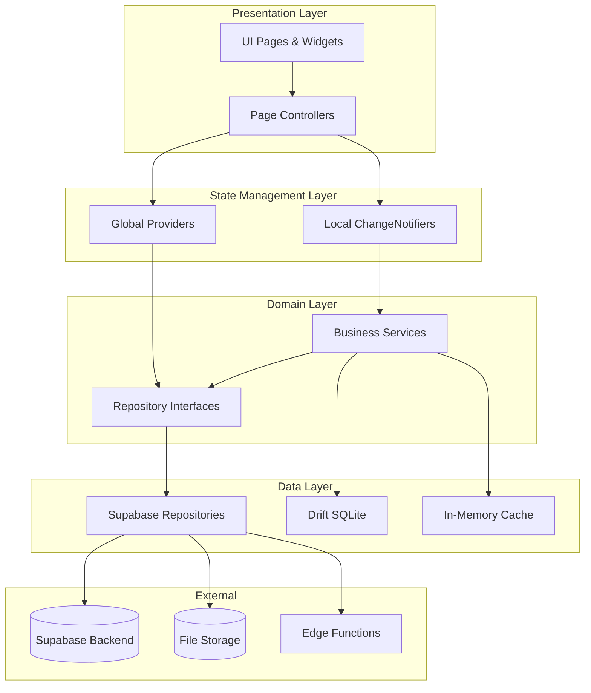

### Layer Responsibilities

| Layer | Responsibility | Key Files |
|-------|---------------|-----------|
| **Presentation** | UI rendering, user input handling | `lib/pages/`, `lib/widgets/` |
| **State Management** | Reactive state, cross-page sharing | `lib/providers/` |
| **Domain** | Business logic, abstractions | `lib/repositories/`, `lib/services/` |
| **Data** | Data persistence, API calls | `lib/repositories/supabase_*.dart` |

---

## Data Flow

### Read Flow (Query)

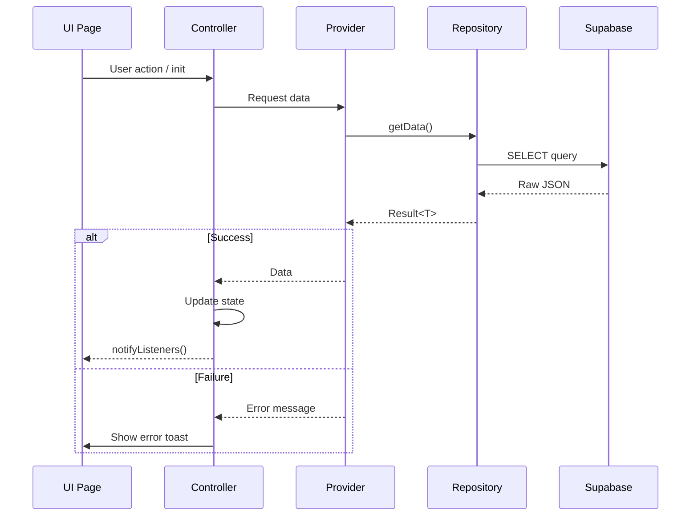

### Write Flow (Mutation)

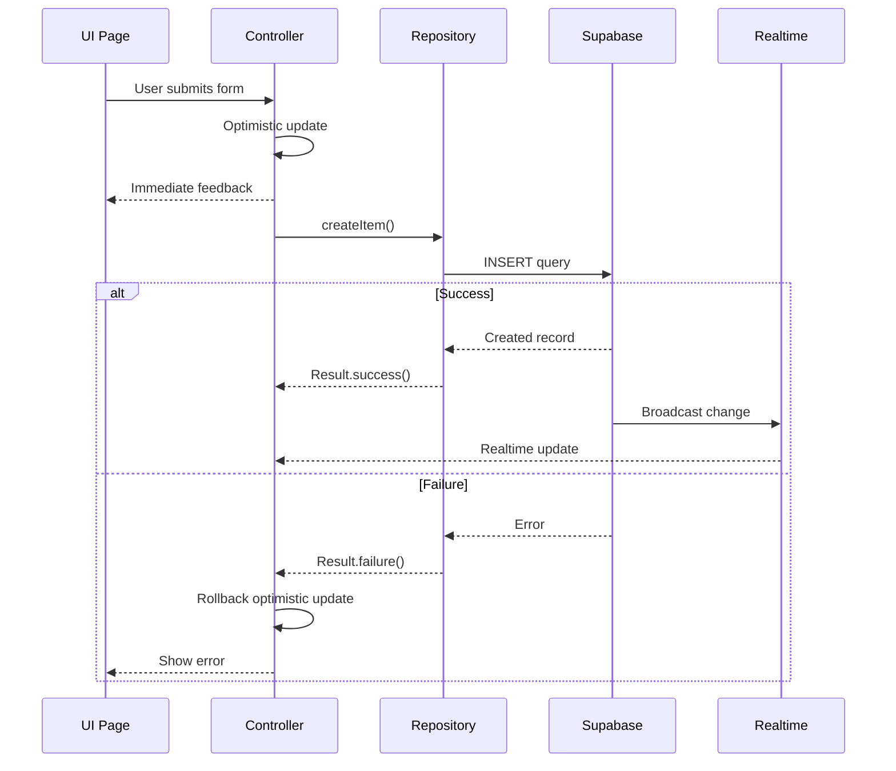

### Offline-First Flow

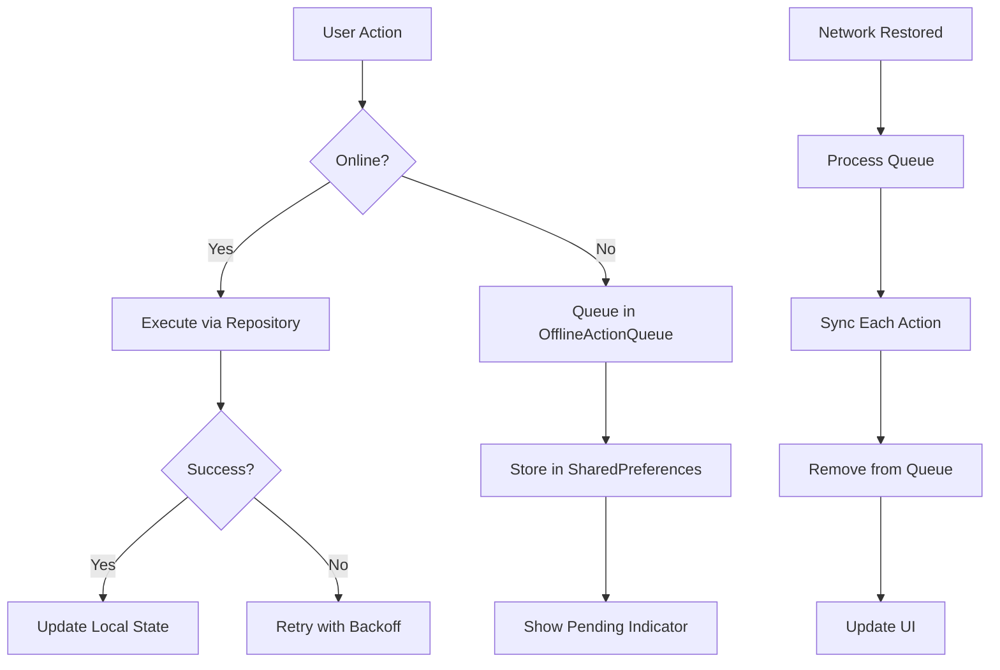

---

## Provider Lifecycle

### Initialization & Cleanup

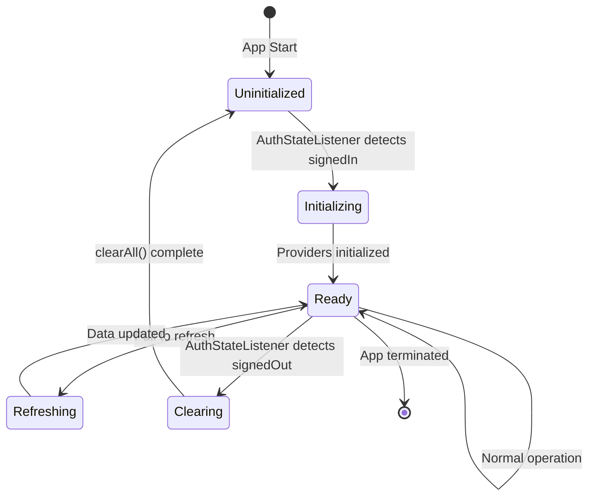

### Provider Registration (main.dart)

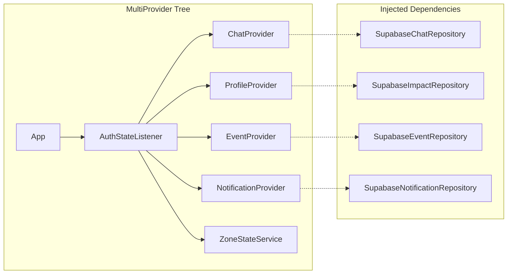

### Auth State Transitions

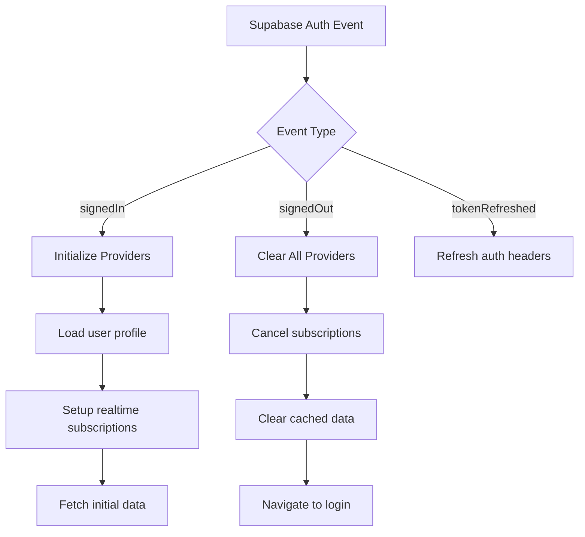

---

## Repository Pattern

### Abstract Interface Design

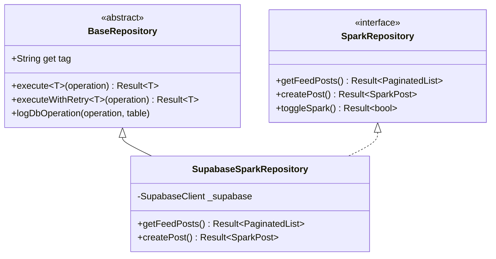

### Repository Registry

| Repository | Interface | Implementation | Domain |
|------------|-----------|----------------|--------|
| Chat | `ChatRepository` | `SupabaseChatRepository` | Direct messaging |
| GroupChat | `GroupChatRepository` | `SupabaseGroupChatRepository` | Group conversations |
| Spark | `SparkRepository` | `SupabaseSparkRepository` | Social feed |
| Impact | `ImpactRepository` | `SupabaseImpactRepository` | User profiles |
| Circle | `CircleRepository` | `SupabaseCircleRepository` | Community groups |
| Space | `SpaceRepository` | `SupabaseSpaceRepository` | Audio rooms |
| Followers | `FollowersRepository` | `SupabaseFollowersRepository` | Social graph |
| Comments | `CommentRepository` | `SupabaseCommentRepository` | Post comments |
| SavedEvents | `SavedEventsRepository` | `SupabaseSavedEventsRepository` | Bookmarks |
| Zone | `ZoneRepository` | `SupabaseZoneRepository` | Event sessions |

---

## Service Layer

### Service Hierarchy

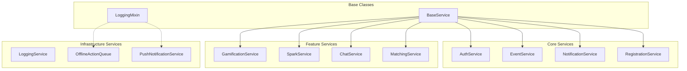

### Singleton Pattern

All services use the lazy-initialization singleton pattern:

```dart
class ExampleService extends BaseService {
  static ExampleService? _instance;
  static ExampleService get instance => _instance ??= ExampleService._();
  ExampleService._();
  
  @override
  String get tag => 'ExampleService';
}
```

---

## Error Handling

### Result<T> Pattern

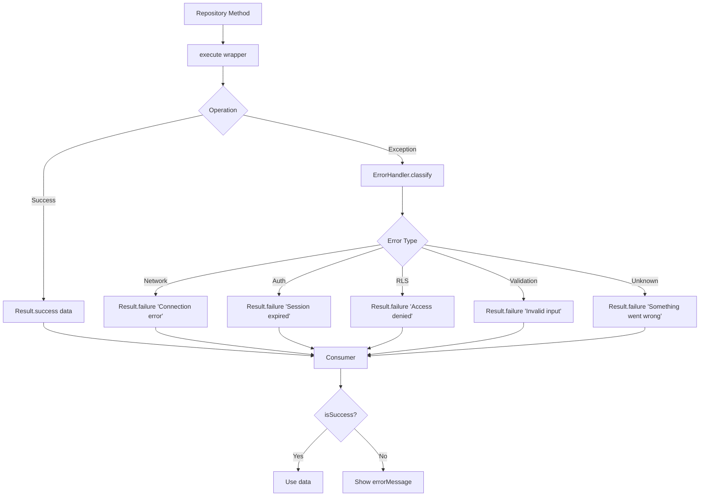

### Error Classification

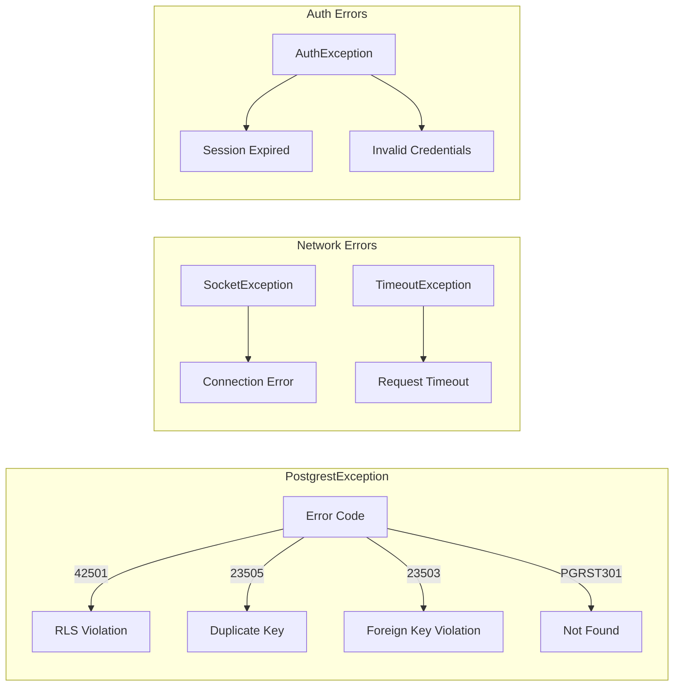

---

## State Management

### Page Controller Pattern

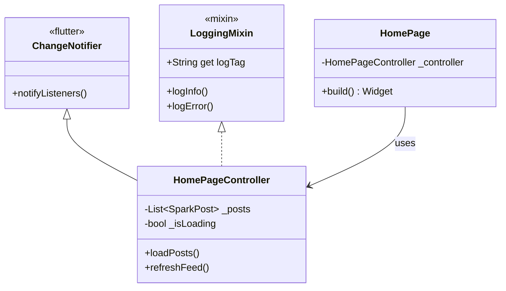

### Global vs Local State

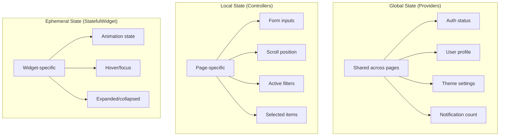

### Realtime Subscriptions

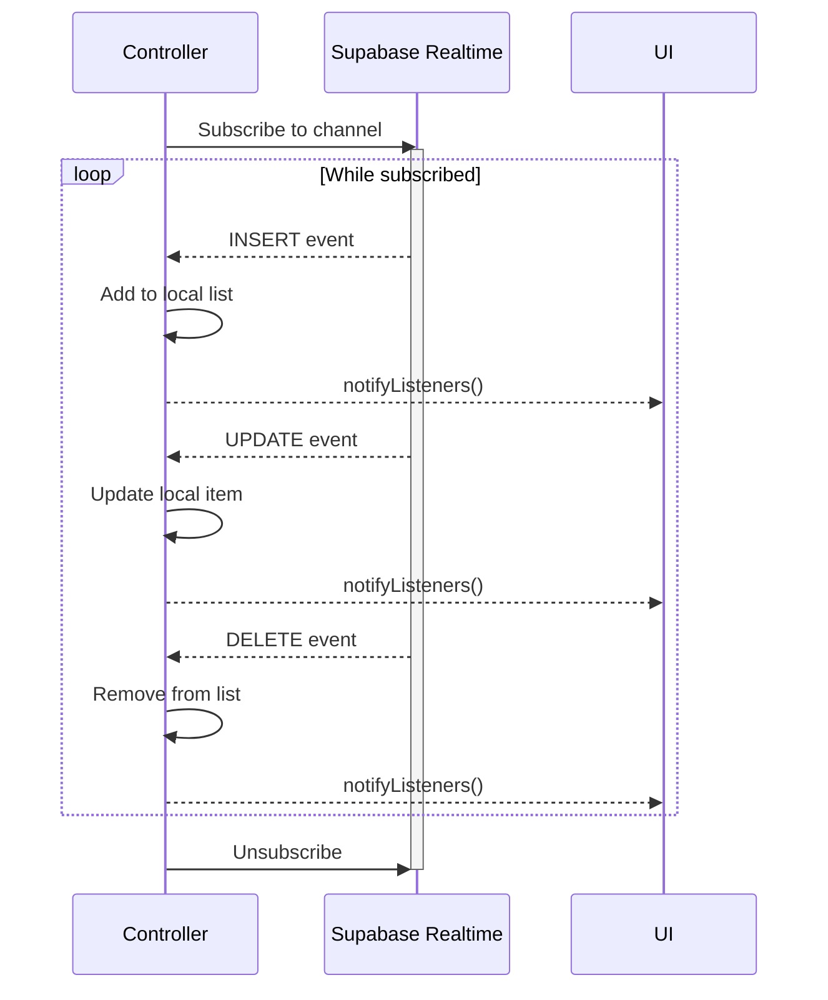

---

## File Structure

```
lib/
├── config/                 # App configuration
│   └── supabase_config.dart
├── models/                 # Data models (immutable)
│   ├── spark_post.dart
│   ├── impact_profile.dart
│   └── ...
├── repositories/           # Data access layer
│   ├── base_repository.dart
│   ├── spark_repository.dart
│   ├── supabase_spark_repository.dart
│   └── ...
├── services/               # Business logic
│   ├── base_service.dart
│   ├── logging_service.dart
│   ├── auth_service.dart
│   └── ...
├── providers/              # Global state management
│   ├── chat_provider.dart
│   └── ...
├── pages/                  # UI screens
│   ├── home/
│   │   ├── home_page.dart
│   │   └── home_page_controller.dart
│   └── ...
├── widgets/                # Reusable components
├── utils/                  # Utilities
│   ├── result.dart
│   └── error_handler.dart
└── main.dart               # App entry point
```

---

## Key Principles

1. **Separation of Concerns**: UI → Controller → Provider → Repository → Supabase
2. **Dependency Inversion**: Controllers depend on abstract repositories, not implementations
3. **Result Pattern**: All async operations return `Result<T>` for explicit error handling
4. **Singleton Services**: Lazy-initialized via `static T get instance` pattern
5. **Optimistic Updates**: UI updates immediately, rollback on failure
6. **Realtime First**: Supabase subscriptions for live data synchronization
7. **Offline Queue**: Actions queued when offline, synced with exponential backoff
